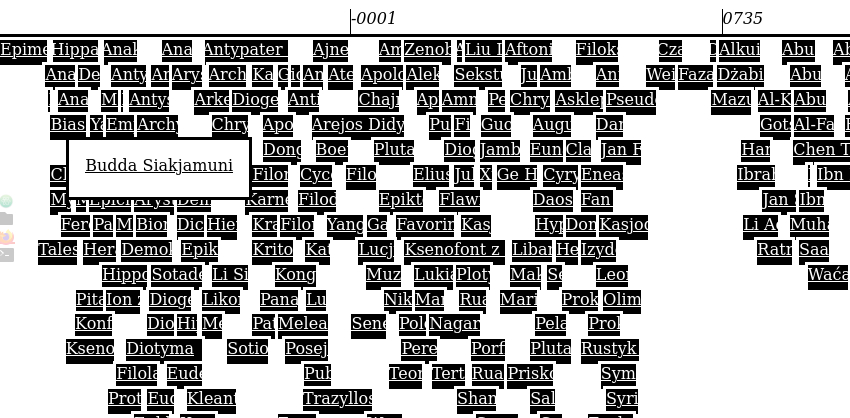

Wiki'Gatherer[.mjs](https://github.com/adamAfro/wiki-gatherer/blob/master/index.mjs)
===================



Imagine a tree, an apple tree - it has branches with lesser branches with lesser branches...
and so on. Some of them have apples on them. In order to take all the apples one needs
to take the apples not only from the big branches but also from the small ones.

That's what gatherer does. It takes all the pages from various categories on wikipedia
ignoring untasteful branches called categories - 'cause no tasty content there.

Why? I was curious how many philosopheres were there throughout history on more visualisation
level and what is the better place to get such data...

Installation and running

0. `git clone https://github.com/adamAfro/wiki-gatherer.git WGDir`
    - `cd WGDir`
    - `npm install`

Globally:
1. `npm install -g`
2. `wiki-gather --help` (**not** _gather**er**_)
3. `wiki-gather -d wikipedia.domain -c "Category:Name" -o outputDir`

Locally:
1. `node run.mjs --help`
2. `node run.mjs -d wikipedia.domain -c "Category:Name" -o outputDir`

In output'dir one may find claims from WikiData (`/WikiData/...`), parsed `data.json` and
`index.html` with demo-page which may be runned inside the browser without server.

---------

Gathering:
```JS
import Gatherer from "./dir-with-lib/index.mjs";

let url = "https://pl.wikipedia.org"; // any site that uses MediaWiki API
let path = "w/api.php" // path to the api

let gatherer = new Gatherer(`${url}/${path}`);

let category = {
    title: "Kategoria: Sofiści" // for example
};

let data = await gatherer.gather(category.title);
/// data -> [{ title, ns, claims }, ...]
```

Parsing:
```JS
import Parser from "./dir-with-lib/parser/index.mjs";

let targetmap = { dates: ["birth", "death"] };

let parser = new Parser(targetmap);

let dataset = [];
for (let item of data)
    dataset.push(parser.parse(item));
/// dataset[i] -> { title, dates: { birth, death } }
```

Displaying:
```JS
import Timeline from "./dir-with-lib/display/index.mjs";

new Timeline(document.getElementById("display"))
    .print(Timeline.parse(dataset, "people"));
```
